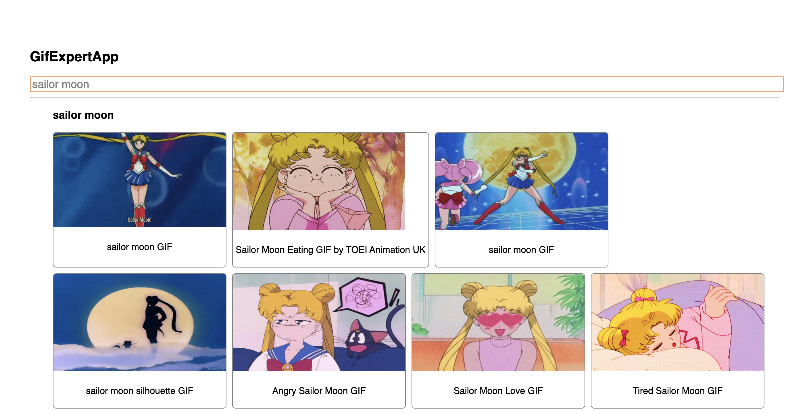

# Gifs Expert App

This is a solution to GiftExpert App. A challenge from React: De cero a experto ( Hooks y MERN ), [Udemy course](https://www.udemy.com/course/react-cero-experto/?utm_source=adwords&utm_medium=udemyads&utm_campaign=ReactNative_v.PROF_la.ES_cc.LATAM&utm_term=_._ag_123389080934_._ad_532651817217_._kw__._de_c_._dm__._pl__._ti_dsa-1293610395746_._li_9060924_._pd__._&matchtype=&gclid=CjwKCAjwlcaRBhBYEiwAK341jWJ8UyJMIblCBR-3j1wk_jAshTiEj3TtGF8RSa2JU4xMOeHfSRzPghoCE1YQAvD_BwE).

## Table of contents

- [Overview](#overview)
  - [The challenge](#the-challenge)
  - [Screenshot](#screenshot)
  - [Links](#links)
- [My process](#my-process)
  - [Built with](#built-with)
  - [What I learned](#what-i-learned)
  - [Continued development](#continued-development)
- [Author](#author)

## Overview

### The challenge

Users should be able to:

- Search and view gifs.
- Use React (components and hooks)

### Screenshot

### Links

- [Solution URL](https://github.com/claurey/gifs-expert-app)
- [Live Site URL](https://claurey.github.io/gifs-expert-app/)

## My process

### Built with

- Semantic HTML5 markup
- CSS custom properties
- React 
- Giphy API

### What I learned

I learned to use hooks in React.

## Author

- Website - [https://claurey.github.io](https://claurey.github.io)
- Twitter - [@claurey591](https://www.twitter.com/claurey591)
